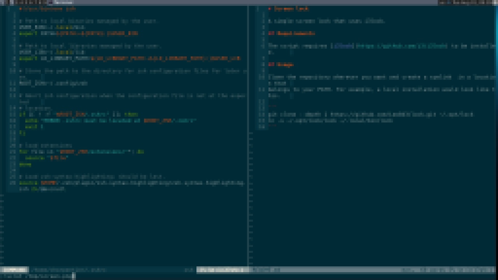

# Screen lock

A simple screen lock that uses i3lock.
The script takes a screenshots and pixelizes it before using it as background.
The user must enter his password to unlock the screen.



## Requirements

The script requires [i3lock](https://github.com/i3/i3lock) to be installed.

## Usage

Clone the repository wherever you want and create a symlink  in a location that
belongs to your PATH. For example, a local installation would look like this.

```
git clone --depth 1 https://github.com/Leo843/lock.git ~/.opt/lock
ln -s ~/.opt/lock/lock ~/.local/bin/lock
```
